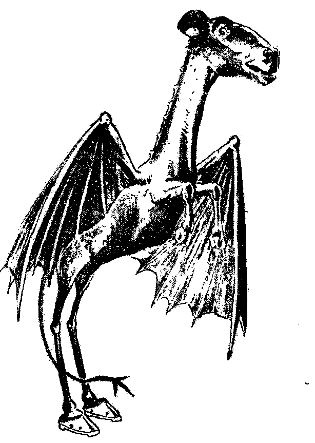

# Ghosts of Jersey - A Devtober Project

This is where I make a game during the month of October 2019.

Programer & Designing: Raccoon-JS

Dialogues: Senshi Sun

Story & Characters: Raccoon-JS

## Game Jam(s)

  <b>This will be an entry for:</b>

  
  
 
   
  

## The Game

<b>(Working) Title: Ghosts of Jersey</b> 

<b>Game Engine</b>: [Godot engine 3.1.1](https://godotengine.org/)

<b>Genre</b>: Visual Novel, Interactive Fiction, horror, & LGBTQ. 

<b>Plot</b>: A young married couple died in an accident, only to become ghosts that will fight against the evil Jersey Devil. And the husband learns that his spouse had a male soul all along, and they renew their relations one and other in the afterlife.

## Tools I will be using

- Emacs
- Vim
- Krita
- GNU Image Manipulation Program
- Audacity

Design with MX Linux 18.3 and Ubuntu 19.01 (and maybe 19.10).
