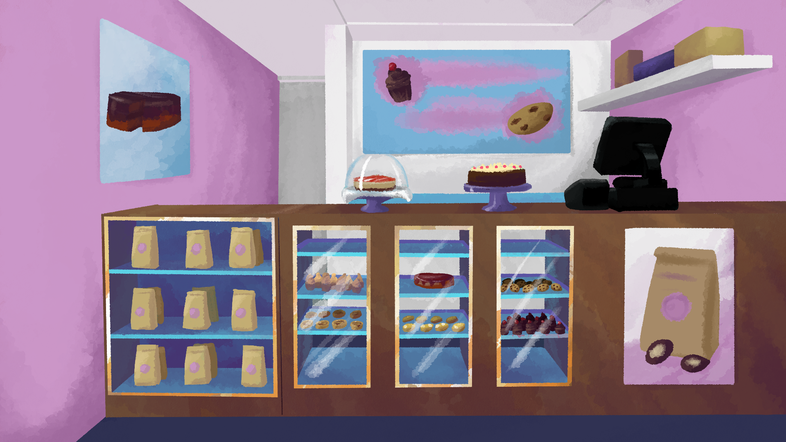

# Ghosts of Jersey - A Devtober Project

This is where I make a game during the month of October 2019.

## Game Jam(s)

This will be an entry for:
- [Bara Jam 2019](https://itch.io/jam/barajam-2019)
- [Cryptid Jam](https://itch.io/jam/cryptid-jam)
- [Gentle Ghost Jam](https://itch.io/jam/gentle-ghost-jam)
- [Devtober 2019](https://itch.io/jam/devtober-2019)

 
 

## The Game

<b>(Working) Title: Ghosts of Jersey</b> 

<b>Game Engine</b>: [Godot engine 3.1.1](https://godotengine.org/)

<b>Genre</b>: Visual Novel, Interactive Fiction, horror, & LGBTQ. 

<b>Plot</b>: A young married couple died in an accident, only to become ghosts that will fight against the evil Jersey Devil. And the husband learns that his spouse had a male soul all along, and they renew their relations one and other in the afterlife.

## Tools I will be using

- Emacs
- Vim
- Krita
- GNU Image Manipulation Program
- Audacity

Design with MX Linux 18.3 and Ubuntu 19.01 (and maybe 19.10).
